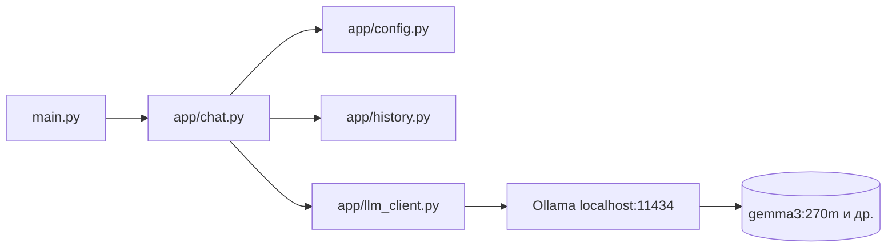

# Итоговый проект «GigaVibeMiptCode»

Консольный ИИ-ассистент с OpenAI-compatible API, историей диалога и контролем длины контекста.

---

## Структура проекта

```
final_project/
├── app/                      # код приложения
│   ├── chat.py               # цикл чата, команды
│   ├── config.py             # загрузка config.yaml и env
│   ├── display.py            # вывод в консоль
│   ├── files.py              # @::путь:: и /file_chunk
│   ├── history.py            # история и лимиты контекста
│   └── llm_client.py         # клиент OpenAI-compatible API
├── config/
│   └── config.yaml.example   # шаблон настроек (без секретов)
├── main.py                   # точка входа
└── ruff.toml
```

| Папка / файл | Назначение |
|--------------|------------|
| `app/` | вся логика: чат, конфиг, LLM, файлы, история |
| `config/` | пример конфигурации; рабочий `config.yaml` сюда же |
| `main.py` | запуск: `python main.py` |

Секреты не в коде: `config/config.yaml` в `.gitignore`.

---

## Как подтянуть модель (Ollama)

Модель **не входит в репозиторий** — её скачивает сервер Ollama. Ваш Python-код только указывает **имя модели** в конфиге.

### 1. Установить Ollama

Скачайте с [ollama.com](https://ollama.com) и запустите (в трее / фоне должен работать сервер).

### 2. Скачать модель в терминале

Лёгкая модель для проверки (из материалов курса):

```bash
ollama pull gemma3:270m
```

Другие варианты:

```bash
ollama pull qwen3.5:0.8b
ollama pull qwen3.5:2b
```

Проверить, что модель есть локально:

```bash
ollama list
```

В колонке **NAME** будет строка вроде `gemma3:270m` — **это же имя** нужно указать в `model` в конфиге.

### 3. Настроить проект

```bash
cd final_project
cp config/config.yaml.example config/config.yaml
```

Отредактируйте `config/config.yaml` (минимум для Ollama):

```yaml
api_key: ollama
api_host: http://localhost:11434/v1
model: gemma3:270m
limit_message: 20
limit_chars: 2000
temperature: 0.7
```

Поле `model` должно **точно совпадать** с именем из `ollama list`.

### 4. Запустить чат

Из корня репозитория:

```bash
uv sync
cd final_project
python main.py
```

На Windows, если `uv` не в PATH:

```powershell
py -m pip install uv
py -m uv sync
cd final_project
py -m uv run python main.py
```

В консоли: `>>> ваш вопрос`, выход — `\q`.

### Схема «кто за что отвечает»



---

## Быстрый старт

```bash
uv sync
cd final_project
ollama pull gemma3:270m
cp config/config.yaml.example config/config.yaml
python main.py
```

### Переменные окружения (приоритет над yaml)

| Переменная | Описание |
|------------|----------|
| `API_KEY` | Токен (для Ollama — любая строка, напр. `ollama`) |
| `API_HOST` | URL API, напр. `http://localhost:11434/v1` |
| `MODEL` | Имя модели из `ollama list` |
| `LIMIT_MESSAGE` | Лимит сообщений в истории |
| `LIMIT_CHARS` | Лимит символов в истории |
| `TEMPERATURE` | 0–1 |

`system_prompt` — **только** в `config/config.yaml`.

Пример (PowerShell):

```powershell
cd final_project
$env:API_KEY = "ollama"
$env:API_HOST = "http://localhost:11434/v1"
$env:MODEL = "gemma3:270m"
$env:LIMIT_MESSAGE = "20"
$env:LIMIT_CHARS = "2000"
$env:TEMPERATURE = "0.7"
python main.py
```

Без `config/config.yaml` (или `config.yaml` в корне `final_project`) и без env — программа завершится с подсказкой.

---

## Функционал

| Пункт | Модуль |
|-------|--------|
| Чат с ИИ | `app/chat.py`, `app/llm_client.py` |
| Контроль контекста | `app/history.py` |
| Конфигурация yaml + env | `app/config.py`, `config/` |
| Ctrl+C при ожидании LLM | `app/chat.py` |
| `@::путь::` | `app/files.py` |
| `/file_chunk` | `app/files.py`, `app/chat.py` |
| `\q`, `/reset` | `app/chat.py` |

### Команды в чате

- `\q` — выход
- `/reset` — очистить историю и экран
- `/file_chunk`, `/file_chunk paragraph=3`, `/file_chunk len=150 -y`

---

## Другие провайдеры

| Провайдер | `api_host` | `model` |
|-----------|------------|---------|
| Ollama | `http://localhost:11434/v1` | из `ollama list` |
| LM Studio | URL Local Server | из списка LM Studio |
| OpenRouter | `https://openrouter.ai/api/v1` | из каталога OpenRouter |
| GigaChat | по документации API | из их списка |

---

## Линтеры

Из корня репозитория:

```bash
uv run ruff check final_project --config final_project/ruff.toml
uv run ruff format --check final_project --config final_project/ruff.toml
uv run mypy final_project
```

Запускайте `python main.py` из каталога `final_project/`.

---

## Частые ошибки

| Ошибка | Решение |
|--------|---------|
| `model not found` | `ollama pull <имя>` и то же имя в `model` |
| `Connection refused` | запустите Ollama |
| сразу выход | создайте `config/config.yaml` или env |
| слабые ответы | нормально для `gemma3:270m`; попробуйте `qwen3.5:2b` |
| `uv` не найден | `py -m pip install uv`, далее `py -m uv run ...` |
